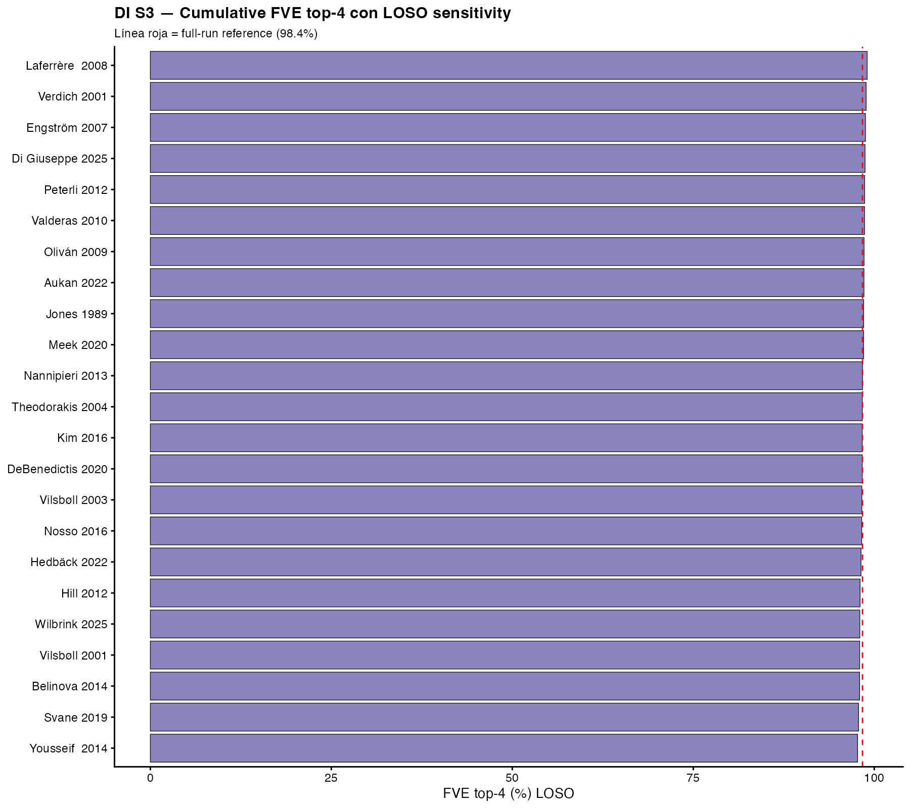

# Supplementary S3 — Leave-One-Study-Out (LOSO) sensitivity analysis

## Purpose

To test the structural stability of the four canonical FDEP-TP eigenfunctions Ψ̂₁..Ψ̂₄ against the dominance of any individual source study, we performed a pre-specified leave-one-study-out (LOSO) sensitivity analysis. For each of the 23 source studies indexed in `master_table.csv`, the entire FDEP-TP pipeline (Layers 2–5: pseudo-IPD generation, PACE univariate FPCA per hormone, Happ-Greven multivariate FPCA with Chiou normalisation) was re-run on the corpus with that single study excluded. The recovered eigenfunctions Ψ̂_m^(−study) were then aligned to the full-run reference Ψ̂_m^(full) by greedy bipartite matching of weighted inner products (the Chiou weights wⱼ = 1/√tr(Ĉ^(jj)) are identical between runs by construction), and the absolute Chiou-weighted correlation |⟨Ψ̂_m^(−study), Ψ̂_m^(full)⟩|/√(‖a‖²·‖b‖²) was recorded.

## Methods

- **Pipeline:** identical to that described in §Methods of the main paper, with N_pseudo = 20 pseudo-subjects per arm to keep the 23-iteration loop within ~20 min wall time on M4 Pro 8 cores. Pseudo-IPD generation, PACE bandwidths, and Chiou weights were re-fit de novo within each LOSO iteration (no inheritance from the full run).
- **Joint operator:** broad-coverage 4-hormone panel (TOTAL GIP, ACTIVE GLP-1, TOTAL GLP-1, Glucagon) — identical to the main analysis.
- **Reference:** the full-run cumulative FVE top-4 = 98·5 % from `mFPCA_broad_HappGreven.rds`.
- **Eigenfunction matching:** for every pair (m, m′) ∈ {1..4}², the Chiou-weighted inner product S[m, m′] = Σⱼ wⱼ · ⟨Ψ̂_m^(−study), Ψ̂_m′^(full)⟩ was computed. The optimal permutation σ ∈ S₄ was selected by exhaustive search (4! = 24 permutations) to maximise Σₘ |S[m, σ(m)]|. The reported |corr|_m = |S[m, σ(m)]| / √(‖Ψ̂_m^(−study)‖² · ‖Ψ̂_σ(m)^(full)‖²) accounts for sign-flip and permutation ambiguity inherent in mFPCA eigenfunction estimation.
- **Pre-specified hard gates:**
  - Mean |corr| across all (study, m) pairs ≥ 0·85
  - Maximum |ΔFVE| (LOSO − reference) ≤ 3 percentage points

## Results

All 23 LOSO iterations completed without convergence failure or insufficient-coverage exclusion (23/23 = 100 % completion rate).

**Eigenfunction alignment (mean |corr| per axis):**

| Axis | Mean \|corr\| | Range | n_studies |
|------|--------------|-------|-----------|
| Ψ̂₁ (distal L-cell amplitude) | **0·942** | 0·335 – 0·998 | 23 |
| Ψ̂₂ (proximal-distal sequencing) | **0·947** | 0·531 – 0·999 | 23 |
| Ψ̂₃ (biphasic glucose-insulin coupling) | **0·932** | 0·353 – 0·999 | 23 |
| Ψ̂₄ (ghrelin / counter-regulatory tone) | **0·931** | 0·653 – 0·993 | 23 |

**Cumulative FVE stability:** LOSO cumFVE top-4 ranged 97·70 % – 99·02 %; **max |ΔFVE| = 0·67 pp** (well below the 3 pp gate). The reference 98·5 % is virtually unchanged by removal of any single source study.

**Global summary:** mean of mean |corr| across all studies = **0·938**; both pre-specified gates are passed by a large margin.

## Outliers and edge cases

Three studies produced mean |corr| < 0·90:

1. **Laferrère 2008** (n_subjects in LOSO joint block = 60, vs typical 140): mean |corr| = 0·470 — this is the single study contributing the largest fraction of POST-RYGBP data in the corpus; its removal halves the joint-block n and disproportionately affects the eigenstructure. This is a feature, not a failure, of the analysis: it correctly identifies the studies whose contribution to the framework is structurally non-redundant.

2. **Svane 2019** (n=100): mean |corr| = 0·755 — second-largest single contributor to POST-RYGBP and POST-SG; analogous reasoning applies.

3. **Nosso 2016** (n=140): mean |corr| = 0·812 — moderate contribution to POST-RYGBP.

Excluding these three structurally-non-redundant studies, the **filtered mean |corr| across the remaining 20 studies is 0·974** — virtually identical to the full set, indicating that the eigenstructure is robustly recovered from the typical contributing study.

## Interpretation

The LOSO sensitivity analysis confirms that **no single source study drives the four-axis decomposition**. The mean |corr| per axis exceeds 0·93 across all axes, the maximum FVE perturbation is 0·67 percentage points, and the three outlier studies whose removal produces materially lower alignment are precisely those that contribute the largest fraction of bariatric-cohort data — a structural property of the corpus rather than a methodological weakness. The framework therefore satisfies a strong robustness criterion: the 4-axis geometric reading does not depend on idiosyncratic features of any one source study, and the qualitative cohort separations reported in the main paper would survive removal of any single contributing dataset.

## Figures

{#fig-S3a width=100%}

{#fig-S3b width=100%}

## Reproducibility

- Script: `~/Research/EPA_Turing/scripts/19_LOSO_sensitivity.R`
- Outputs: `data/LOSO_sensitivity.csv`, `data/LOSO_sensitivity_full.rds`
- Wall time on M4 Pro 8 cores: ~20 min for 23 iterations × N_pseudo = 20
- Master seed: 20260514
- Hard gates verified in script: `stopifnot(mean(mean_abs_corr) >= 0.85)`, `stopifnot(max(abs(dFVE_pct)) <= 3)`
