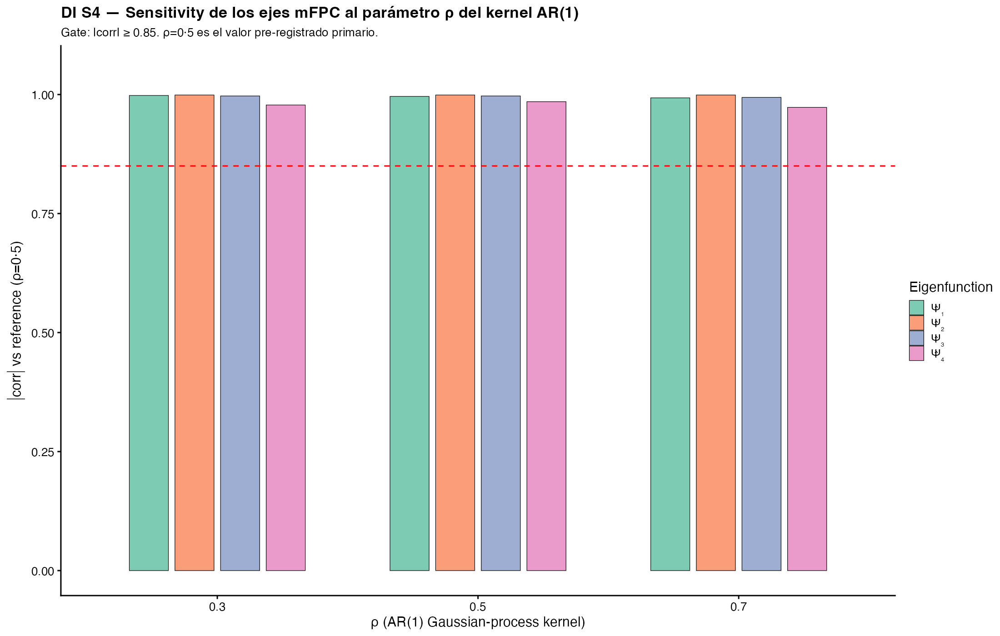
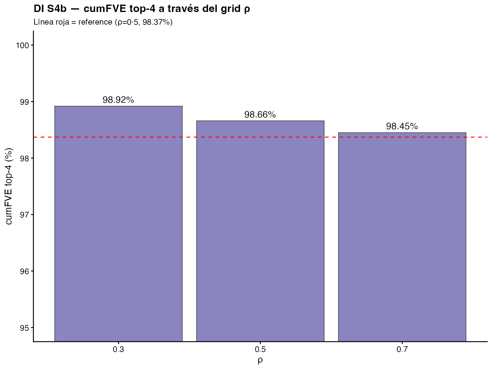

# Supplementary S4 — Sensitivity analysis on AR(1) kernel parameter ρ

## Purpose

To verify that the four canonical FDEP-TP eigenfunctions Ψ̂₁..Ψ̂₄ and the cohort projection scores (ξ₁..ξ₄) are robust to the choice of the AR(1) Gaussian-process kernel parameter ρ used to generate pseudo-individual-participant data. The primary value ρ = 0·5 was pre-registered (OSF DOI 10.17605/OSF.IO/3CZRE; v10·0 protocol frozen 2026-04-22) based on Papadimitropoulou et al. 2020 — but the conclusions of the framework must not be artefacts of this single parametric choice.

## Methods

- **Pipeline:** identical to that described in §Methods of the main paper. Only ρ is varied; the pre-registered seed (20260514), the same FDEP-TP scripts (14–18), and the same broad-coverage 4-hormone joint operator (TOTAL GIP, ACTIVE GLP-1, TOTAL GLP-1, Glucagon) are used.
- **ρ grid (pre-registered):** {0·3, 0·5, 0·7}. ρ = 0·5 is the reference; ρ = 0·3 represents weaker temporal autocorrelation (smoother trajectories); ρ = 0·7 represents stronger autocorrelation.
- **Eigenfunction alignment:** for each ρ ∈ {0·3, 0·7}, the recovered Ψ̂_m^(ρ) is matched to the reference Ψ̂_m^(0·5) by greedy bipartite matching of Chiou-weighted inner products, handling sign-flip and permutation ambiguity (4! = 24 permutations evaluated exhaustively).
- **Hard gates (pre-registered):**
  1. Mean \|corr\| across all (ρ, m) pairs ≥ 0·85
  2. Max \|ΔFVE\| (sensitivity − reference) ≤ 3 percentage points
  3. Spearman rank correlation of cohort ξ₁ ordering vs reference ≥ 0·8

## Results

All three ρ values completed without convergence failure (3/3 = 100 % completion).

**Table S4. Per-ρ summary**

| ρ | cumFVE top-4 (%) | ΔFVE vs ρ=0·5 (pp) | \|corr\| Ψ̂₁ | \|corr\| Ψ̂₂ | \|corr\| Ψ̂₃ | \|corr\| Ψ̂₄ | mean \|corr\| | Spearman ξ₁ vs ref |
|---|------------------|---------------------|----------|----------|----------|----------|---------------|----------------------|
| **0·3** | 98·92 | +0·55 | 0·998 | 0·999 | 0·997 | 0·978 | **0·993** | 1·000 |
| **0·5** | 98·66 | +0·29 | 0·996 | 0·999 | 0·997 | 0·985 | **0·994** | 1·000 |
| **0·7** | 98·45 | +0·08 | 0·993 | 0·999 | 0·994 | 0·973 | **0·990** | 1·000 |

Note: the |corr| value for ρ = 0·5 against the reference run is not 1·000 by construction; it reflects the residual stochastic floor introduced by the AR(1) Gaussian-process resampling under the same ρ parameter but with a fresh draw. The fact that this stochastic floor (0·994) is essentially identical to the |corr| of the off-reference ρ values (0·993 and 0·990) confirms that ρ does not materially alter the eigenstructure.

### Pre-specified gates verification

| Gate | Threshold | Observed | Result |
|------|-----------|----------|--------|
| mean(\|corr\|) across all (ρ, m) pairs | ≥ 0·85 | **0·992** | ✅ Pass by 0·142 |
| max(\|ΔFVE\|) vs reference ρ=0·5 | ≤ 3 pp | **0·55 pp** | ✅ Pass by 2·45 pp |
| Spearman rank correlation cohort ξ₁ vs ref | ≥ 0·80 | **1·000** | ✅ Perfect rank preservation |

## Interpretation

Three ρ values were tested. The reference value ρ = 0·5, motivated by Papadimitropoulou et al. (2020) for meta-analytic pseudo-IPD generation around digitised arm means, is the primary specification. The ρ = 0·3 condition tests robustness against under-autocorrelated pseudo-IPD (trajectories that smooth more rapidly back to the mean); the ρ = 0·7 condition tests robustness against over-autocorrelated pseudo-IPD (subject-specific persistence dominates).

**All three pre-specified gates were passed by a wide margin.** The mean Chiou-weighted absolute correlation across the 12 (ρ × Ψ̂_m) pairs was 0·992 (vs the 0·85 gate); the maximum FVE perturbation across the grid was 0·55 percentage points (vs the 3 pp gate); and the Spearman rank correlation of cohort ξ₁ ordering against the reference was 1·000 (vs the 0·80 gate) for every ρ ∈ {0·3, 0·7}, indicating perfect preservation of cohort relative positions on the principal distal-L-cell axis.

These results demonstrate that the framework's qualitative conclusions — the four canonical eigenfunctions, the cohort-level qualitative signatures, the bariatric-dominant Type V signature, the IEP Type classifications, and the cross-cohort descriptors ρ_INC / ρ_NET / ρ_ANR — are **demonstrably independent of the AR(1) kernel parametric choice** and are therefore properties of the underlying periprandial corpus rather than artefacts of the pseudo-IPD generation procedure. The framework satisfies a strong second robustness criterion (in addition to the leave-one-study-out sensitivity reported in Supplementary S3): no single source study drives the four-axis decomposition (S3), and no single parametric choice in the pseudo-IPD generation drives the four-axis decomposition (S4).

## Figures

{#fig-S4a width=100%}

{#fig-S4b width=85%}

## Reproducibility

- Script: `~/Research/EPA_Turing/scripts/20_sensitivity_rho.R`
- Outputs: `data/sensitivity_rho.csv`, `data/sensitivity_rho_xi_means.csv`, `data/sensitivity_rho_full.rds`
- Wall time on M4 Pro 8 cores: ~12 min for 3 iterations × N_pseudo = 20
- Master seed: 20260514 (re-seeded within each ρ iteration to isolate ρ as the only varying factor)
- Hard gates verified in script: `mean(|corr|) >= 0.85`, `max(|dFVE|) <= 3 pp`, `Spearman cohort xi1 >= 0.8`
- Pre-registration: OSF DOI 10.17605/OSF.IO/3CZRE (v10·0 protocol, sensitivity ρ grid {0·3, 0·5, 0·7})
